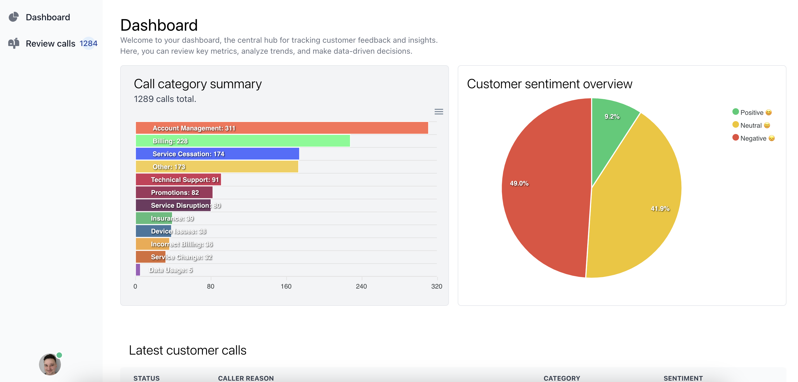
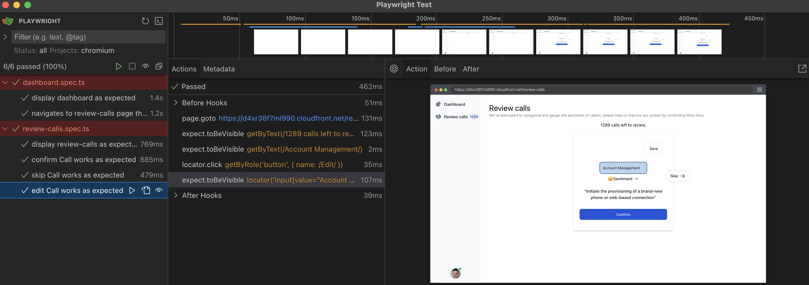

# Customer Intents


## Demo deployed on AWS
- [Web](https://d4xr38f7ml990.cloudfront.net)
- [API](https://d1fno9ot74vctf.cloudfront.net)

## Initial spec
Your task is to build a webpage which provides an analytical dashboard of the distribution of the caller intents. You will be given a list of intents for the calls in a file as input. It is up to you how you present this data to the user.
<br/>
<br/>
It is expected that you will manipulate the data in some way to overcome the drawback
mentioned in the background information.
<br/>
<br/>
It is a requirement that the webpage has the associated code to deploy it to AWS for hosting.


## Apps and Packages

- `api`: a [NestJs](https://nestjs.com/) api
- `web`: a [React](https://react.org/) app
- `infra`: a [AWS CDK](https://docs.aws.amazon.com/cdk/v2/guide/home.html) tsc repo
- `docs`: initial specification docs and challenge information


## Local development

### Prerequisites
- [nodejs](https://nodejs.org)
- [pnpm](https://pnpm.io/installation)
- [aws cli](https://aws.amazon.com/cli)

## API
```bash
cd ./api

# Copy the .env.example -> .env for local development
pnpm i

pnpm dev

```


## Web
```bash
cd ./web

# Copy the .env.example -> .env for local development
pnpm i

pnpm dev
```

### E2E Tests


```bash
cd ./web
pnpm test:e2e:ui 
```

## Infra
```bash

cd ./infra 

# Setup the environment, only needed to be run once initially
cdk bootstrap

# Deploy infra to current AWS cli configuration env
npx cdk deploy --all

```

### Building a new image for the deployment (currently manual)

```bash
docker build --platform linux/amd64 -t api .
docker tag api:latest <acount_number>.dkr.ecr.ap-southeast-2.amazonaws.com/api:latest
docker push acount_number.dkr.ecr.ap-southeast-2.amazonaws.com/api:latest

# etc
docker build --platform linux/amd64 -t api .
docker tag api 879381257941.dkr.ecr.ap-southeast-2.amazonaws.com/api:v4
docker push 879381257941.dkr.ecr.ap-southeast-2.amazonaws.com/api:v4

# Update the api-stack.ts image tag reference etc

image: ecs.ContainerImage.fromEcrRepository(repository, "v3")

# To test the uploaded ECR image locally
docker pull 879381257941.dkr.ecr.ap-southeast-2.amazonaws.com/api:v3
docker run -p 3005:3000 879381257941.dkr.ecr.ap-southeast-2.amazonaws.com/api:v3
```


## Notes
- I read the initial spec, estimated it would take me till Monday-Tuesday, gave deadline of Wednesday
- Broke down initial work, scaffolding, first aim to get something live and integrated.
- Determined tech stack based off initial requirements and the tech I'm keen to use.
- Got the infra and web/api deployed and integrated, after lots of learning with cdk and relearning with AWS.
- Designed and built the basic API to serve the data, as well as the UI to display it.
- For me the key thing to solve was that the summary isn't fully reliable, it needs to be double checked by a user, which can then be fed back into the system to improve the model.

## Todo

### Something live and integrated
- [x] Reread the spec
- [x] Setup UI with basic react app
- [x] Setup NestJs api
- [x] Setup infra with AWS CDK

### Initial featureset
- [x] Implement parsing and categorizing raw data as json
- [x] Design and build dashboard
- [x] Customer intent review process POC
- [x] E2E tests
- [x] Local development setup and running readme
- [ ] Record loom

### Future Improvements
- [ ] Component level tests
- [ ] Jotai (state) tests
- [ ] Infra (cdk) tests
- [ ] Setup GitHub actions to build + test + deploy
- [ ] Setup postgres database instead of json file/internal state
- [ ] Determine whether to use prisma or something else for ORM + Migrations
- [ ] Design db schema and seed data
- [ ] Integrate API with database
- [ ] Properly implement customer intent reviews


## Out of scope

- Authentication, authorisation
- Custom domain names
- Docker compose